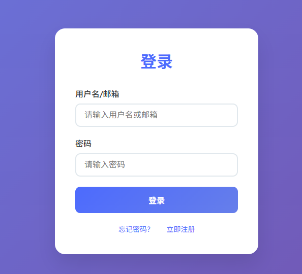
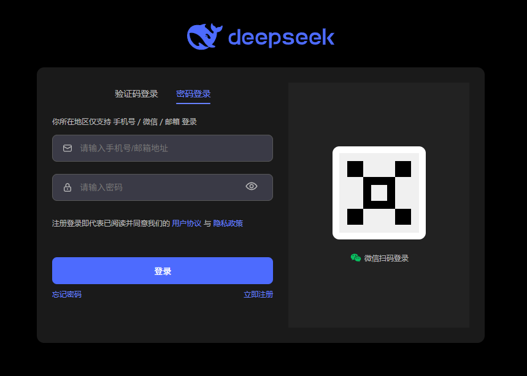

# 登录页面项目

一个简洁美观的登录页面，采用现代化的设计风格和响应式布局。

## 功能特性

- 🎨 **现代化设计**：渐变背景、圆角卡片、阴影效果
- 📱 **响应式布局**：适配各种屏幕尺寸
- ⚡ **流畅动画**：页面加载动画和交互动画
- 🛡️ **表单验证**：实时输入验证和错误提示
- 🔄 **加载状态**：登录过程中的加载指示器
- 🔧 **错误处理**：资源加载异常检测和自动刷新

## 技术特点

- 纯 HTML/CSS/JavaScript 实现
- 无外部依赖，轻量级
- CSS3 动画和渐变效果
- 语义化 HTML 结构
- 现代化的 UI 设计理念

## 文件结构

```
login/
├── login_page_simple.html    # 登录页面简化版
├── form_wechat_login.html    # 登录页面（表单+微信二维码登录）
└── README.md                 # 项目说明文档
```

## 登录页面简化版


## 登录页面（表单+微信二维码登录）


## 快速开始

1. 直接双击 `form_wechat_login.html` 文件在浏览器中打开（表单+微信二维码登录版本）
2. 或双击 `login_page_simple.html` 文件打开简化版登录页面
2. 或者使用本地服务器（推荐用于开发）：
   ```bash
   # 使用 Python 内置服务器
   python -m http.server 8000
   
   # 使用 Node.js http-server
   npx http-server
   ```

## 使用说明

### 表单输入
- **用户名/邮箱**：支持用户名或邮箱地址格式
- **密码**：支持任意字符，有基本的非空验证

### 交互功能
- 输入框获得焦点时有视觉反馈
- 输入验证失败时显示错误提示
- 登录按钮有悬停和点击效果
- 登录过程中显示加载动画
- 页面加载异常时提供刷新选项

## 自定义配置

### 样式修改
主要样式在 `<style>` 标签内，可以轻松修改：
- 背景渐变色：修改 `body` 的 `background` 属性
- 主题色：修改 `.logo h1`、`.login-button` 等的颜色值
- 动画效果：调整 `@keyframes` 相关参数

### 功能扩展
- 添加记住我功能
- 集成第三方登录（微信、QQ等）
- 添加验证码功能
- 实现真实的后端接口对接

## 浏览器兼容性

- ✅ Chrome 60+
- ✅ Firefox 55+
- ✅ Safari 11+
- ✅ Edge 79+
- ⚠️ IE 11（部分动画效果可能不支持）

## 开发建议

1. **性能优化**：考虑将 CSS 和 JavaScript 分离到独立文件
2. **安全加固**：实现 HTTPS、防止 XSS 攻击
3. **无障碍支持**：添加 ARIA 标签和键盘导航
4. **国际化**：支持多语言切换

## 许可证

MIT License - 可自由使用和修改

## 作者

MrSong9957

---

如有问题或建议，欢迎提交 Issue 或 Pull Request。